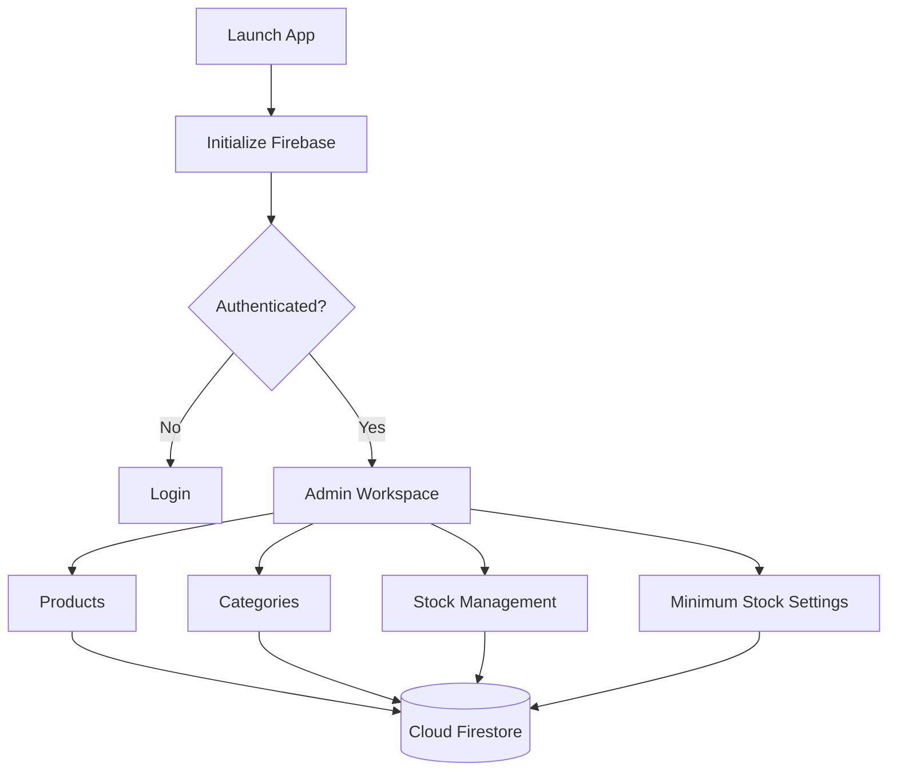

# Darken Store — Stock Management App

A Flutter-based mobile application for **admin-only product and inventory management**, built with Firebase Authentication and Cloud Firestore.

> **Academic Project — Mobile Application Development**
>
> Final course project. Successfully completed according to the project requirements and received an **A grade**.

## Overview

Darken Store is an internal inventory-management application designed to help an administrator maintain product records and monitor stock from a mobile interface. It is **not an e-commerce or sales application**.

The frontend is built with **Flutter**, while authentication and application data are handled through **Firebase Authentication** and **Cloud Firestore**.

## Problem

Maintaining product records, categories, stock quantities, and minimum-stock thresholds can become inconvenient without a dedicated management interface.

This project addresses that need by providing an admin-oriented mobile workspace where inventory data can be maintained and updated directly from the application.

## Solution

The application connects Flutter screens to Firebase services so authenticated administrators can:

- View product inventory
- Add, edit, and delete products
- Organize products by category
- Increase or decrease stock
- Configure minimum-stock thresholds
- Review product details
- Maintain administrator records

Product changes also record the authenticated administrator UID and server-side timestamps.

## Key Features

### Admin Authentication
Firebase Authentication is used to control access to the management interface. The application checks authentication state before loading the main workspace.

### Product Management
Products contain a name, stock quantity, price, category, creation metadata, and update metadata.

### Category Management
Products can be assigned to categories for more organized inventory management.

### Stock Management
A dedicated screen lets administrators increase or decrease stock quantities. The interface visually distinguishes low and normal stock levels.

### Minimum Stock Settings
Administrators can configure a minimum-stock threshold to identify inventory that needs attention.

## Application Flow



## Screenshots

The repository includes screenshots for the major management workflows.

### Login


### Dashboard


### Product Management


### Add Product


### Edit Product


### Product Details


### Category Management


### Add Category


### Edit Category


### Delete Product


### Delete Category


### Stock Management


### Minimum Stock Settings


## Data Model

### Product

| Field | Purpose |
|---|---|
| `id` | Firestore document ID |
| `name` | Product name |
| `stock` | Current stock quantity |
| `price` | Product price |
| `categoryId` | Product category reference |
| `createdBy` | Creator UID |
| `createdAt` | Creation timestamp |
| `updatedBy` | Last updater UID |
| `updatedAt` | Last update timestamp |

### Admin

| Field | Purpose |
|---|---|
| `id` | Admin UID |
| `name` | Admin name |
| `email` | Admin email |
| `role` | Admin role |
| `createdAt` | Creation timestamp |
| `updatedAt` | Last update timestamp |

## Firebase Integration

The application uses:

- **Firebase Authentication** for administrator authentication
- **Cloud Firestore** for products, categories, and admin records

The main collections used by the application include:

```text
admins
product
product_categories
```

The product service performs CRUD operations on the `product` collection and records the authenticated UID and timestamps for product changes.

## Implementation Highlights

Firebase is initialized at application startup:

```dart
await Firebase.initializeApp(
  options: DefaultFirebaseOptions.currentPlatform,
);
```

Authentication state is then handled through `AuthWrapper`, which routes unauthenticated users to the login screen and authenticated users to the main workspace.

Product data is read through Firestore snapshots, allowing the product list to react to database changes.

Stock changes use a dedicated update operation that persists the new quantity together with administrator metadata.

## Technology Stack

- Flutter
- Dart
- Firebase Authentication
- Cloud Firestore
- Shared Preferences
- Material Design

The repository's `pubspec.yaml` includes `firebase_core`, `firebase_auth`, `cloud_firestore`, and `shared_preferences`.

## Project Structure

```text
Darken-Store--Management-Product-App/
├── android/
├── ios/
├── linux/
├── macos/
├── web/
├── windows/
├── assets/
│   └── images/
├── lib/
│   ├── auth/
│   │   └── auth_wrapper.dart
│   ├── models/
│   │   ├── admin.dart
│   │   ├── product.dart
│   │   └── product_category.dart
│   ├── screens/
│   │   ├── add_product_screen.dart
│   │   ├── category_list_screen.dart
│   │   ├── edit_product_screen.dart
│   │   ├── home_screen.dart
│   │   ├── login_screen.dart
│   │   ├── manage_stock_screen.dart
│   │   ├── product_list_screen.dart
│   │   └── set_min_stock_screen.dart
│   ├── services/
│   │   ├── admin_service.dart
│   │   ├── category_service.dart
│   │   └── product_service.dart
│   ├── widgets/
│   ├── firebase_options.dart
│   └── main.dart
├── screenshots/
├── firebase.json
├── pubspec.yaml
└── README.md
```

## Installation

### Prerequisites

- Flutter SDK
- Dart SDK compatible with the project
- Android Studio or another Flutter development environment
- A Firebase project

### 1. Clone the repository

```bash
git clone https://github.com/darhay/Darken-Store--Management-Product-App.git
cd Darken-Store--Management-Product-App
```

### 2. Install dependencies

```bash
flutter pub get
```

### 3. Configure Firebase

The repository currently contains the generated `lib/firebase_options.dart`.

For a new Firebase project, configure FlutterFire again:

```bash
flutterfire configure
```

Enable Firebase Authentication and Cloud Firestore for the configured Firebase project.

### 4. Run

```bash
flutter run
```

## Security Note

The public repository contains `lib/firebase_options.dart`, including Firebase client API keys and project identifiers.

These are **client configuration values, not Firebase Admin SDK private credentials**. They are normally embedded in client applications. The repository's `.gitignore` explicitly excludes `serviceAccountKey.json` and `.env`, which is appropriate. citeturn763265view0turn716773view0

I did not find evidence in the repository search of a committed Firebase service-account private key, `private_key`, or `client_email` credential. However, Firebase Security Rules and API restrictions should still be reviewed before reusing the project publicly. Firebase client configuration being public does **not** replace proper Firestore authorization rules.

## Limitations

- The application is an **inventory/stock management tool**, not a sales or e-commerce platform.
- It is primarily designed around an administrator workflow.
- Payment, orders, customers, cart, and sales processing are outside the project scope.
- The Firebase client configuration is coupled to the project.

## Project Outcome

Darken Store demonstrates a complete Flutter-to-Firebase workflow for a mobile inventory management application. The project focused on the mobile frontend and its integration with Firebase Authentication and Cloud Firestore, covering product, category, stock, authentication, and minimum-stock management.

The project successfully fulfilled the requirements for the Mobile Application Development course and received an **A grade**.

## Repository

[GitHub Repository](https://github.com/darhay/Darken-Store--Management-Product-App)

## Author

**Haydar Qisyaam Sangadji**

Undergraduate Informatics Student  
Universitas Khairun
