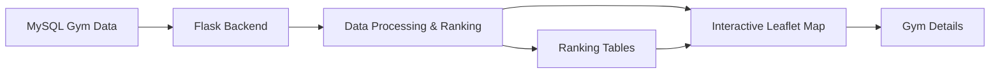
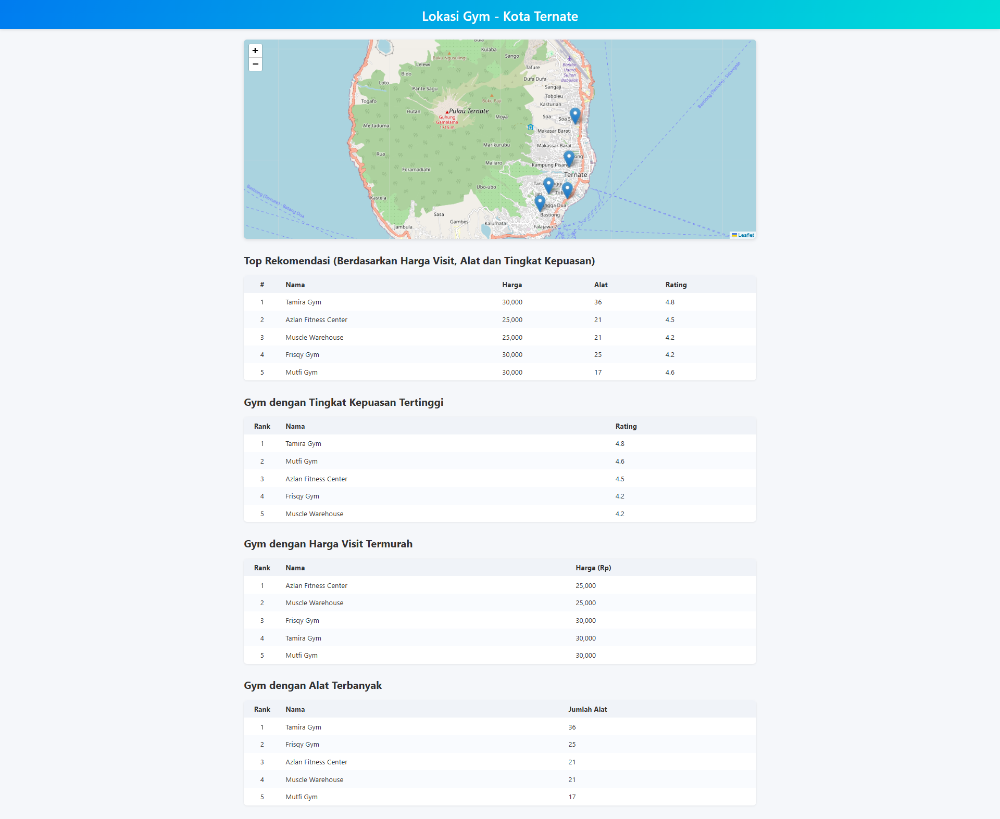

# Gym Ternate GIS

A web-based Geographic Information System (GIS) for exploring gym locations in Ternate and comparing them through map-based visualization and data-driven rankings.

> **Course Project — Geographic Information Systems (GIS)**
>
> Completed as an academic project and received an **A grade**.

## Overview

Finding a suitable gym can involve comparing several factors at once, such as location, visit price, available equipment, and user rating. When this information is presented separately, comparing options can be inconvenient.

This project combines geographic visualization with structured gym data to provide a single interface for exploring gym locations in **Ternate** and identifying recommended options based on multiple criteria.

## Problem

Gym information can be fragmented across different sources, making it inconvenient to compare options based on both **location and gym characteristics**.

For this GIS course project, the objective was to transform location-based gym data into an interactive web map that supports exploration, comparison, and ranking.

## Solution

The application was developed as a Flask-based web GIS that connects gym data stored in MySQL with an interactive Leaflet map. Each gym can be explored through its geographic marker and detailed information, while ranking tables help compare gyms by:

- Overall recommendation score
- User rating
- Visit price
- Number of available equipment

The recommendation score combines **visit price, equipment count, and rating**, allowing multiple factors to be considered instead of ranking gyms on price alone.

## Key Features

### Interactive Gym Map

Displays gym locations across Ternate using **Leaflet** markers. Selecting a gym provides additional information such as price, equipment, operating hours, owner/contact information, equipment types, programs, and rating.

### Multi-Criteria Recommendation

The application calculates a project-specific recommendation score using:

```text
score = visit_price / (equipment_count × rating)
```

A lower score represents a more favorable combination of affordability, equipment availability, and rating under the implemented scoring method.

### Multiple Ranking Views

The application provides separate rankings for:

- Top overall recommendations
- Highest-rated gyms
- Lowest visit prices
- Gyms with the most equipment

### Map-to-Table Interaction

Selecting a gym from a ranking table can zoom the map to the corresponding location, connecting the tabular analysis with its geographic context.

## System Workflow



## Application Screenshot

### Main Map and Ranking Interface

The application combines the interactive map with ranking tables, allowing users to explore gym locations and compare available options from a single interface.



## Data Presented

Each gym record can include:

| Information | Description |
|---|---|
| Name | Gym name |
| Location | Latitude and longitude |
| Visit Price | Price for a visit |
| Equipment | Number of available equipment |
| Equipment Types | Types of equipment available |
| Rating | User satisfaction/rating value |
| Opening Hours | Operating schedule |
| Program | Available programs/services |
| Owner | Gym owner information |
| Contact | Contact information |
| Membership Prices | Registered and private membership prices |

The data is loaded from the `gyms` MySQL table and converted into map markers and ranking datasets by the Flask application.

## Technology Stack

- **Python**
- **Flask**
- **MySQL**
- **mysql-connector-python**
- **Pandas**
- **Leaflet.js**
- **HTML**
- **CSS**
- **JavaScript**

## Project Structure

```text
rekomendasi-tempat-gym-ternate/
│
├── static/
│   └── css/
│       └── style.css
│
├── templates/
│   └── index.html
│
├── app.py
├── config.py
├── db_setup.py
├── insert_bulk.py
├── requirements.txt
└── screencapture-127-0-0-1-5050-2026-08-27-17_50_54.png
```

## Implementation Highlights

The Flask backend reads the `gyms` table into a Pandas DataFrame and prepares the data for both map markers and ranking tables.

The application creates independent rankings based on:

- Visit price
- Equipment count
- Rating
- A combined recommendation score

The combined score is calculated as:

```python
df["score"] = df["price_visit"] / (
    df["equipment_count"] * df["rating"]
)
```

The top 10 results are then used for the recommendation ranking.

The frontend uses Leaflet for map visualization and provides modal-based details for selected gyms. It also exposes separate ranking sections for recommendations, satisfaction, and price.

## Installation

### 1. Clone the repository

```bash
git clone https://github.com/darhay/rekomendasi-tempat-gym-ternate.git
cd rekomendasi-tempat-gym-ternate
```

### 2. Create a virtual environment

```bash
python -m venv venv
```

Activate it on Windows:

```bash
venv\Scripts\activate
```

### 3. Install dependencies

```bash
pip install -r requirements.txt
```

### 4. Configure MySQL

Create the database and `gyms` table using the repository's database setup script:

```bash
python db_setup.py
```

Then configure the MySQL connection settings in `config.py`.

### 5. Insert the gym data

Run the bulk insertion script as needed:

```bash
python insert_bulk.py
```

### 6. Run the application

```bash
python app.py
```

The application runs locally on:

```text
http://127.0.0.1:5050
```

## Project Outcome

This project demonstrates how GIS concepts can be combined with web development and database-driven analysis to make location-based information easier to explore and compare.

Rather than displaying gym locations as points on a map alone, the application connects **geographic visualization, structured data, and multi-criteria ranking** in one interface.

As a **Geographic Information Systems course project**, the project was completed successfully and received an **A grade**.

## Limitations

The recommendation mechanism is based on the scoring formula implemented in the application and should be interpreted as a project-specific ranking method rather than a universal measure of gym quality.

The application is also designed as a local academic project and is not currently presented as a production-scale location service.

## Repository

[GitHub Repository](https://github.com/darhay/rekomendasi-tempat-gym-ternate)

## Author

**Haydar Qisyaam Sangadji**

Undergraduate Informatics Student  
Universitas Khairun
