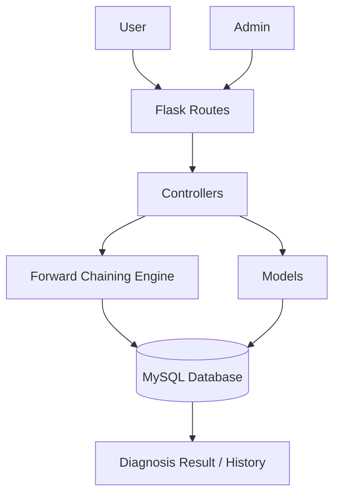

# Potato Plant Disease Expert System

A web-based expert system for identifying potential potato plant diseases from observed symptoms using **Forward Chaining**. The application combines a rule-based inference engine, a MySQL knowledge base, user authentication, diagnosis history, and administrative management features.

> **Academic Project — Decision Support Systems / Expert System coursework**
>
> The system was developed with a backend-oriented focus and successfully fulfilled the required system specifications, earning an **A grade**.

## Overview

Identifying plant diseases from symptoms requires connecting observable conditions with a structured set of disease knowledge and rules. This project explores how a rule-based expert system can formalize that reasoning process into a web application.

Users select observed symptoms during a consultation. The inference engine then compares the selected symptoms against the stored rules and returns a matching potato disease when all required symptoms for a rule are satisfied.

## Problem

Plant disease identification can be difficult when users do not have immediate access to agricultural expertise. Symptoms must be interpreted in relation to known disease characteristics, and manually checking multiple conditions can be inefficient.

The project addresses this by organizing disease knowledge into a structured database and implementing an automated rule-based inference process that maps symptom inputs to a possible disease.

## Solution

The application uses **Forward Chaining** as its inference mechanism. User-selected symptoms become the input facts, which are evaluated against disease rules stored in the database. A disease is returned when the required symptoms associated with that disease are satisfied.

The system is implemented as a Flask web application with a MySQL backend and separates application concerns into controllers, models, routes, templates, and static assets. The repository contains a dedicated `forward_chaining_engine.py` responsible for the inference process.

## How Forward Chaining Works

The implemented inference flow is:

```text
User selects symptoms
        ↓
Validate symptom selection
        ↓
Forward Chaining Engine
        ↓
Compare input symptoms with disease rules
        ↓
Check whether all required symptoms match
        ↓
Return matched disease
        ↓
Store diagnosis result
        ↓
Display diagnosis
```

The implementation evaluates each disease by counting:

- `total_gejala` — the number of symptoms required by the disease's rules
- `cocok` — the number of required symptoms present in the user's input

A disease is considered a match when:

```text
cocok = total_gejala
and
cocok > 0
```

The engine then returns the corresponding disease ID.

## Key Features

### Symptom-Based Consultation

Users can select a set of observed symptoms through the diagnosis page. The application validates the number of selected symptoms before running the inference process.

The current implementation requires users to select between **5 and 9 symptoms** for a consultation.

### Forward Chaining Inference

The inference engine evaluates user-provided symptoms against the rules stored in MySQL and identifies a matching disease when all required symptoms are satisfied.

### Diagnosis Result

After successful inference, the diagnosis result is stored in the database and presented back to the user.

### Diagnosis History

Previous diagnosis results are stored with the user account and can be retrieved as diagnosis history.

### User Authentication

The application provides registration, login, logout, password recovery, date-of-birth verification, and password reset functionality.

### Administrative Management

The admin area provides management interfaces for the system's knowledge base, including:

- Symptoms
- Diseases
- Rules
- Knowledge-base data
- Diagnosis records

This structure allows the rule base to be maintained without changing the inference engine itself.

## Application Screenshots

The repository contains screenshots covering both the user workflow and the administrative workflow.

### 1. User Homepage

The user-facing area provides access to the diagnosis workflow and account-related features.


### 2. Diagnosis Page

Users select symptoms observed on the potato plant before submitting the consultation.


### 3. Diagnosis Result

The system presents the resulting disease after the forward-chaining process completes.


### 4. Diagnosis History

Users can review previously stored diagnosis results.


### 5. Admin Dashboard

The administrative interface provides a central area for managing the system.


### 6. Knowledge Base Management

The administrator can review and manage the knowledge base used by the inference engine.


### 7. Rule Management

Rules connecting symptoms to diseases can be managed from the admin interface.


### 8. Symptom Management

The symptom database can be reviewed and maintained by the administrator.


### 9. Disease Management

Disease records and their descriptions can be managed through the admin interface.


## System Architecture



The repository uses a layered structure consisting of routes, controllers, models, templates, static assets, and a dedicated inference engine. The Flask application registers separate authentication, user, and admin blueprints.

## Database Design

The database schema includes tables for:

| Table | Purpose |
|---|---|
| `User_Tabel` | Stores user accounts, roles, and profile information |
| `Gejala_Tabel` | Stores symptoms and their descriptions/categories |
| `Penyakit_Tabel` | Stores disease information |
| `Aturan_Tabel` | Connects diseases with their required symptoms |
| `HasilDiagnosa_Tabel` | Stores diagnosis results and timestamps |

The rule table uses foreign keys to connect `Penyakit_Tabel` and `Gejala_Tabel`, forming the knowledge base used by the inference engine.

## Technology Stack

- **Python**
- **Flask**
- **MySQL**
- **mysql-connector-python**
- **Jinja2 / HTML**
- **CSS**
- **JavaScript**
- **Werkzeug Security**

## Project Structure

```text
spk-penyakit-kentang/
│
├── app/
│   ├── controllers/
│   │   ├── aturan_controller.py
│   │   ├── auth_controller.py
│   │   ├── basis_pengetahuan_controller.py
│   │   ├── diagnosa_controller.py
│   │   ├── forward_chaining_engine.py
│   │   ├── gejala_controller.py
│   │   ├── hasil_diagnosa_controller.py
│   │   ├── penyakit_controller.py
│   │   └── registrasi_controller.py
│   │
│   ├── models/
│   │   ├── admin.py
│   │   ├── akun.py
│   │   ├── aturan.py
│   │   ├── gejala.py
│   │   ├── hasil_diagnosa.py
│   │   ├── penyakit.py
│   │   └── user.py
│   │
│   ├── routes/
│   │   ├── admin_routes.py
│   │   ├── auth_routes.py
│   │   └── user_routes.py
│   │
│   ├── static/
│   ├── templates/
│   │   ├── admin/
│   │   ├── auth/
│   │   ├── user/
│   │   └── base.html
│   │
│   ├── config.py
│   └── __init__.py
│
├── baca_csv/
│   ├── convert_to_db.py
│   ├── dataset penyakit kentang.csv
│   └── output_aturan_unik.txt
│
├── insertDb/
├── screenshots/
├── insert_dummy.py
├── setup_db.py
├── run.py
├── requirements.txt
└── README.md
```

## Implementation Details

### Forward Chaining Engine

The inference engine is implemented in:

```text
app/controllers/forward_chaining_engine.py
```

Its main method receives a list of selected symptom IDs and queries `Aturan_Tabel` to find diseases whose complete required symptom set is contained in the user's input.

Conceptually:

```python
input_gejala -> rule matching -> disease candidate -> diagnosis
```

### Diagnosis Processing

The diagnosis controller:

1. Retrieves the submitted symptoms.
2. Validates that 5–9 symptoms were selected.
3. Passes the symptoms to `ForwardChainingEngine`.
4. Handles the case where no disease matches.
5. Stores the successful diagnosis in `HasilDiagnosa_Tabel`.

### Authentication and Access Control

The application distinguishes between `admin` and `user` roles and registers them through separate Flask blueprints.

User passwords are handled using Werkzeug's password hashing functions for standard user authentication.

## Data Preparation

The repository includes a CSV-based dataset and helper scripts for converting the source data into the database structure.

```text
baca_csv/
├── dataset penyakit kentang.csv
├── convert_to_db.py
└── output_aturan_unik.txt
```

The resulting rule data is represented in relational form through the symptom, disease, and rule tables.

## Installation

### 1. Clone the repository

```bash
git clone https://github.com/darhay/spk-penyakit-kentang.git
cd spk-penyakit-kentang
```

### 2. Create a virtual environment

```bash
python -m venv venv
```

Activate on Windows:

```bash
venv\Scripts\activate
```

### 3. Install dependencies

The repository currently contains an empty `requirements.txt`, so dependencies should be installed manually based on the imports used by the application.

At minimum:

```bash
pip install flask mysql-connector-python werkzeug
```

### 4. Configure MySQL

Create a local MySQL database named:

```text
spk_project
```

The current application configuration expects:

```text
Host: localhost
User: root
Password: empty
Database: spk_project
```

Update `app/config.py` when using different credentials.

### 5. Create the database tables

```bash
python setup_db.py
```

### 6. Run the application

```bash
python run.py
```

Then open:

```text
http://127.0.0.1:5000
```

## Project Outcome

The project successfully implemented the required rule-based decision process as a functioning web application. Its strongest technical aspect is the backend implementation: the application connects a structured MySQL knowledge base to a dedicated **Forward Chaining inference engine**, while also providing authentication, diagnosis persistence, and administrative knowledge-base management.

Although the interface is relatively simple compared with modern production applications, the project demonstrates practical experience in:

- Rule-based reasoning
- Backend architecture
- Relational database design
- CRUD operations
- Authentication and role-based access
- Separating inference logic from application routing and presentation

As an academic project, it fulfilled the specified system requirements and received an **A grade**.

## Limitations

- The user interface is primarily oriented toward functional delivery rather than polished product design.
- The inference mechanism follows a deterministic rule-matching approach and does not provide probabilistic confidence scores.
- The current implementation is intended as a local academic project rather than a production-ready agricultural diagnosis service.
- `requirements.txt` should be populated before the repository is intended for easier one-command environment setup.

## Repository

[GitHub Repository](https://github.com/darhay/spk-penyakit-kentang)

## Author

**Haydar Qisyaam Sangadji**

Undergraduate Informatics Student  
Universitas Khairun
