# Student Mental Health Prediction

A machine learning-based web application for predicting students' mental health tendencies from academic, lifestyle, and digital-activity-related factors.

> **Research Project / Undergraduate Thesis**
>
> The system was developed as part of an undergraduate thesis using **Random Forest** for multiclass classification and **Streamlit** as the interactive user interface.

## Overview

University students, particularly those frequently involved in programming and other digital academic activities, may experience stress, anxiety, or depressive symptoms that can be difficult to identify early. This project explores whether students' academic, lifestyle, and digital activity patterns can be used as input for a machine learning model to predict their mental health tendency.

The resulting system combines a preprocessing pipeline, Random Forest training, model evaluation, and a Streamlit-based prediction interface.

## Problem

Mental health conditions among university students can be influenced by a combination of academic demands, lifestyle patterns, and daily digital activities. Identifying potential tendencies from these factors is not straightforward, especially when the available information consists of multiple categorical and Likert-scale responses.

The project therefore investigates how machine learning can be applied to classify students into several mental-health-related categories based on structured questionnaire data.

## Solution

The system uses a **Random Forest Classifier** trained on questionnaire-derived features. The preprocessing pipeline removes identifying fields, encodes categorical variables, normalizes the features, and uses DASS-21-based scoring to establish the target label used for model training.

For the deployed interface, users provide demographic and lifestyle information followed by a set of digital-activity and academic-activity responses. The trained model then returns a predicted class together with the model's prediction probability, training accuracy, and confusion matrix.

The application classifies four outcomes:

- **Normal**
- **Stress Tendency**
- **Anxiety Tendency**
- **Depression Tendency**

> **Important:** This application is a research prototype and **not a clinical diagnostic tool**. Its predictions should not be interpreted as a medical diagnosis.

## Results

The model was evaluated using four train-test split configurations:

| Train / Test Split | Accuracy | Precision | Recall | F1-score |
|:---:|---:|---:|---:|---:|
| 60 / 40 | 58.06% | 57.19% | 58.06% | 54.98% |
| 70 / 30 | 56.99% | 62.53% | 56.99% | 53.85% |
| 80 / 20 | 59.68% | 64.98% | 59.68% | 57.84% |
| **90 / 10** | **61.29%** | **65.13%** | **61.29%** | **60.10%** |

The **90:10 split** produced the highest F1-score among the tested configurations and was used by the Streamlit application.

### Confusion Matrix

The final 90:10 model produced the following confusion matrix:

| Actual \ Predicted | Depression | Anxiety | Stress | Normal |
|---|---:|---:|---:|---:|
| Depression Tendency | 2 | 0 | 1 | 1 |
| Anxiety Tendency | 1 | 1 | 1 | 1 |
| Stress Tendency | 1 | 0 | 9 | 3 |
| Normal | 0 | 0 | 3 | 7 |

### Feature Importance

The training pipeline also calculates Random Forest feature importance for each split and stores the resulting rankings as CSV and PNG files.


## Application Screenshots

### 1. Initial Questionnaire

The first step collects demographic and lifestyle information such as age, gender, semester, living arrangement, sleep duration, and exercise frequency.


### 2. Digital Activity Questionnaire

The second step collects Likert-scale responses related to digital academic activities, programming workload, emotional conditions, anxiety-related symptoms, and stress-related responses.


<details>
<summary>View the full questionnaire screenshot</summary>

The screenshot above contains the complete long-form questionnaire interface.


</details>

### 3. Prediction Result

The final screen presents the predicted mental-health category, prediction probability, model accuracy, training-data count, and the model's confusion matrix.


## How the System Works

```mermaid
flowchart LR
    A[Questionnaire Data] --> B[Data Cleaning]
    B --> C[Categorical Encoding]
    C --> D[DASS-21-Based Labeling]
    D --> E[Feature Normalization]
    E --> F[Random Forest Training]
    F --> G[Model Evaluation]
    G --> H[Saved 90:10 Model]
    H --> I[Streamlit Application]
    I --> J[Mental Health Prediction]
```



## Dataset and Preprocessing

The study dataset was collected through a questionnaire from **313 respondents**. An anomaly-detection step identified inconsistent responses, resulting in **310 usable records** for model development.

The preprocessing pipeline includes:

1. Removing timestamps and personally identifying fields from the modeling data.
2. Encoding categorical demographic and lifestyle variables.
3. Converting the DASS-21 response scale from 1–4 to 0–3.
4. Calculating depression, anxiety, and stress scores.
5. Assigning one of four target classes according to the project labeling rules.
6. Applying Min-Max normalization to the model features.
7. Encoding the target labels for model training.

The repository contains dedicated scripts for anomaly detection, preprocessing, training, visualization, and application inference.

## Model

The project uses `RandomForestClassifier` from `scikit-learn`.

The training configuration used in the repository includes:

```python
RandomForestClassifier(
    n_estimators=200,
    max_depth=10,
    min_samples_split=4,
    min_samples_leaf=2,
    max_features="sqrt",
    class_weight="balanced",
    random_state=42,
    n_jobs=-1
)
```

The model was trained with stratified train-test splits and compared across 60:40, 70:30, 80:20, and 90:10 configurations.

## Streamlit Application

The prediction interface is implemented using **Streamlit**.

The application follows a three-step flow:

1. **Initial Questionnaire** — demographic and lifestyle information.
2. **Digital Activity Questionnaire** — 28 Likert-scale activity and symptom-related inputs.
3. **Prediction Result** — predicted class, prediction probability, model accuracy, and confusion matrix.

At inference time, the application maps user inputs to the same feature representation expected by the trained model, performs the prediction, and displays the result.

## Project Structure

```text
RF-Deteksi-Kesehatan-Mental/
│
├── modelsc/
│   └── trained Random Forest models
│
├── resultsc/
│   ├── confusion_matrix_*.csv
│   ├── confusion_matrix_*.png
│   ├── feature_importance_*.csv
│   ├── feature_importance_*.png
│   └── model_comparison.csv
│
├── streamlit_rf/
│   ├── app.py
│   └── assets/
│       └── style.css
│
├── deteksi_anomali_kuesioner.py
├── preprocessing.py
├── column_after_preprocessing.py
├── training_clean.py
├── visualisasi_tree_enhance.py
│
├── dataset_murni_dengan_label.csv
├── dataset_clean_rf_fix_bersih.csv
└── README.md
```

## Installation

### 1. Clone the repository

```bash
git clone https://github.com/darhay/RF-Deteksi-Kesehatan-Mental.git
cd RF-Deteksi-Kesehatan-Mental
```

### 2. Create a virtual environment

```bash
python -m venv venv
```

Activate it on Windows:

```bash
venv\Scripts\activate
```

### 3. Install dependencies

```bash
pip install pandas numpy scikit-learn matplotlib seaborn joblib streamlit
```

### 4. Run the Streamlit application

```bash
streamlit run streamlit_rf/app.py
```

The application will open in the browser at the local Streamlit address shown in the terminal.

## Reproducing the Training Pipeline

The repository separates the main machine learning workflow into several scripts.

### Anomaly detection

```bash
python deteksi_anomali_kuesioner.py
```

This checks for questionnaire records in which the Likert responses are constant across the analyzed response columns and produces a cleaned dataset.

### Preprocessing

```bash
python preprocessing.py
```

This performs categorical encoding, DASS-21-based label generation, feature normalization, and target encoding.

### Model training

```bash
python training_clean.py
```

This trains and evaluates Random Forest models across multiple train-test splits, then saves trained models, confusion matrices, feature-importance results, and the comparison table.

## Technologies

- **Python**
- **Pandas**
- **NumPy**
- **scikit-learn**
- **Random Forest**
- **Matplotlib**
- **Seaborn**
- **Joblib**
- **Streamlit**

## Key Takeaways

This project demonstrates an end-to-end machine learning workflow:

**Questionnaire Data → Data Cleaning → Feature Engineering → Labeling → Normalization → Random Forest Training → Model Evaluation → Interactive Deployment**

It combines machine learning implementation with a user-facing web interface, making the project both a research experiment and a practical software prototype.

## Repository

[GitHub Repository](https://github.com/darhay/RF-Deteksi-Kesehatan-Mental)

## Author

**Haydar Qisyaam Sangadji**

Undergraduate Informatics Student  
Universitas Khairun
